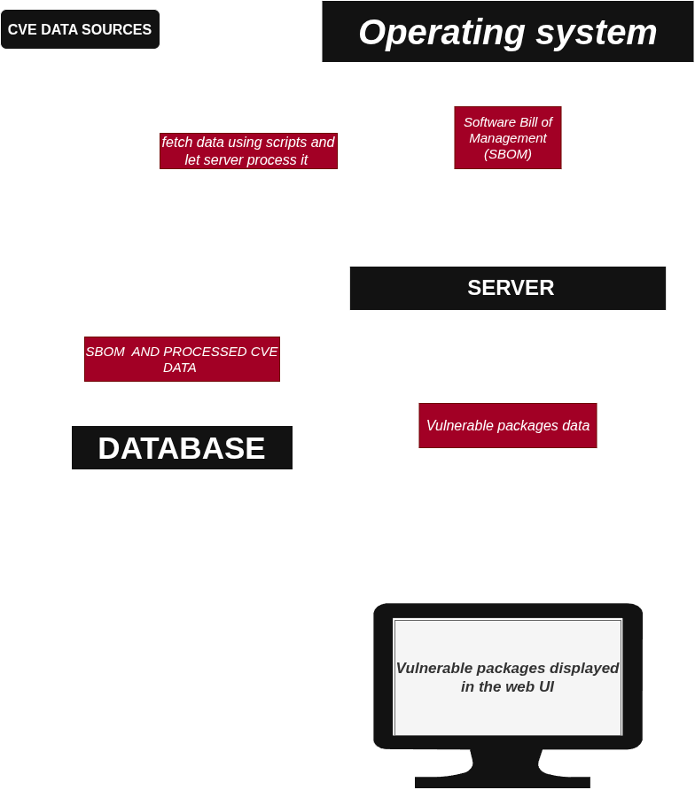

# Sentinel

**Sentinel** is a lightweight, self-hostable open-source CVE telemetry tool that continuously audits Debian/Ubuntu system packages against known vulnerabilities from the OSV dataset.

---

## Supported Architectures & OS

* **Supported OS:** Debian / Ubuntu (and derivatives)
* **Architecture:** Linux `x86_64` (`amd64`)

---

## Architecture Overview



---

## Installation

### Method 1: Quick Installation

Download, extract, and execute `v0.1.0-beta.0` in a single command:

```bash
wget -q https://github.com/As1agi/sentinel/releases/download/v0.1.0beta/sentinel-v0.1.0-beta.0-linux-amd64.tar.gz && \
tar -xzf sentinel-v0.1.0-beta.0-linux-amd64.tar.gz && \
cd sentinel-v0.1.0-beta.0-linux-amd64 && \
chmod +x ./*.sh && \
./sentinel.sh
````

### Method 2: Manual Installation

#### 1. Download Release

Download `sentinel-v0.1.0-beta.0-linux-amd64.tar.gz` from the [GitHub Releases](https://github.com/As1agi/sentinel/releases/download/v0.1.0beta ) page, or pull it via `wget`:


```bash
wget  https://github.com/As1agi/sentinel/releases/download/v0.1.0beta/sentinel-v0.1.0-beta.0-linux-amd64.tar.gz
```

#### 2. Extract Archive

Bash

```bash
tar -xzf sentinel-v0.1.0-beta.0-linux-amd64.tar.gz
cd sentinel-v0.1.0-beta.0-linux-amd64
```

#### 3. Run Sentinel


```bash
# Grant execution permissions to runtime scripts
chmod +x ./sentinel.sh ./server/scripts/FetchCveData.sh

# Run the orchestration pipeline
./sentinel.sh
```

## Automated Scanning (Optional Cron Setup)

To automatically run Sentinel in the background and sync vulnerability telemetry every 18 hours, run the cron installer script:

```bash
./install_cron.sh
```

